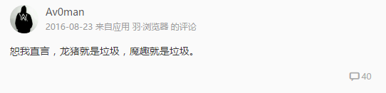
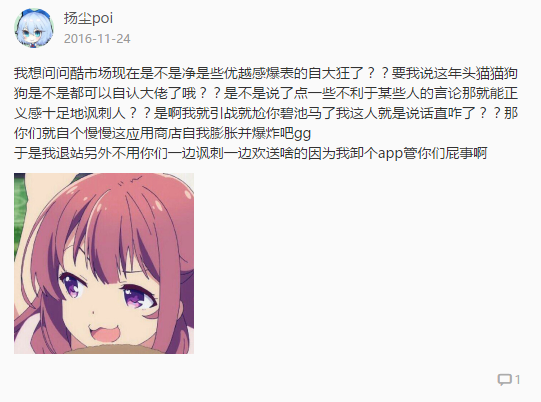
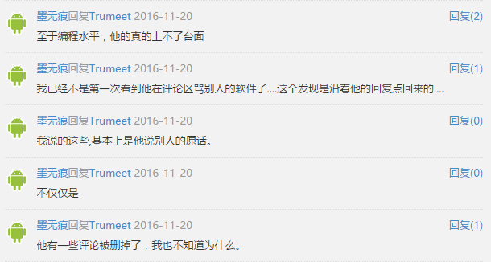
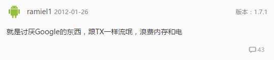
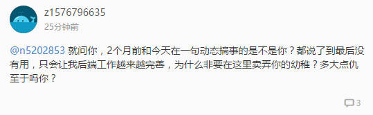

# The PoH of forums
#### 0x00 [Av0man](http://coolapk.com/u/414898) (刘畅)

> Av0man 其它的通信方式：
>
> [Er0Chang](http://weibo.com/p/1005051812556161) on Weibo

#### 0x01 [扬尘poi](http://coolapk.com/u/580252)

> 扬尘poi 其它的通信方式：
>
> [扬尘poi](http://weibo.com/u/2376487073) on Weibo

#### 0x02 [墨无痕](http://coolapk.com/u/581058)

> Rachel 注：必须强调，第一点我没骂人，第二点我没有删除过评论，稍微与我交往的人都很清楚了，这人只是因为我吐槽 Lua 可操作性不强引来的

#### 0x03 [ramiel1](http://www.coolapk.com/u/139414)

#### 0x04 [z1576796635](http://www.coolapk.com/u/533453)

#### 0x05 [pipichong](http://coolapk.com/u/455710)

